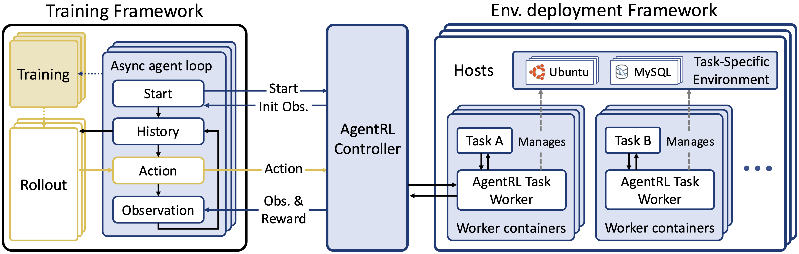

# AgentRL

Scaling Agentic Reinforcement Learning with a Multi-Turn, Multi-Task Framework

<p align="center">
   <a href="https://arxiv.org/abs/2510.04206" target="_blank">📃 Paper</a>
</p>

## Table of Contents

- [Quickstart](#quickstart)
- [Architectural Overview](#architectural-overview)
- [Training Overview](#training-overview)
  - [Installation](#installation)
  - [Getting Started](#getting-started)
  - [Placement Group](#placement-group)
  - [Workers](#workers)
  - [Data](#data)
- [Environment Overview](#environment-overview)
  - [Controller](#controller)
  - [Task Worker](#task-worker)
  - [Transport Layer](#transport-layer)
  - [Deployment](#deployment)
- [Evaluation](#evaluation)
  - [`agentrl-eval`](#agentrl-eval)
- [Acknowledgements](#acknowledgements)
- [License](#license)
- [Citation](#citation)

## Quickstart

- For a minimal example of how to use the environment framework,
refer to [`examples/simple-calculator`](examples/simple-calculator).

- For the environment and training data used in our paper,
see [AgentBench FC](https://github.com/THUDM/AgentBench).

- For reproducing the training results in our paper,
refer to [`examples/training/agentrl_trainer.py`](examples/training/agentrl_trainer.py).

## Architectural Overview



This project mainly consists of two parts: the training framework and the environment deployment framework.

- For the training framework, see [Training Overview](#training-overview).
The code is available in the [`trainer`](trainer) directory.

- For the environment deployment framework, see [Environment Overview](#environment-overview).
The code of the controller and the task worker is available in [`controller`](controller) and [`worker`](worker) respectively.

## Training Overview

AgentRL training package provide basic workers and components to compose a training routine.

### Installation

```shell
pip install -e ./trainer
```

### Getting Started

We take [`async_trainer.py`](examples/training/async_trainer.py) as an example to demonstrate how to compose a fully asynchronous GRPO agentic training pipeline.

`async_trainer` trains LLM agents by utilizing three specialised worker pools over a Ray cluster:

1. **Rollout workers** explore tasks and stream trajectories.
2. **Actor workers** compute gradients and update the policy.
3. **Reference workers** maintain a frozen baseline for KL regularisation.

Actor and reference workers colocate on one resource group(placement group), rollout locate on another. 
Tasks are asynchronously generated by the **Task Manager** component with the help of rollout workers. 
At each step, the trainer pushes new tasks to the task manager, and pulls the old data to train it using GRPO algorithm with actor and reference workers.

The following sections explain the key abstractions.

### Placement Group

[Ray](https://github.com/ray-project/ray) placement groups are the entry point for reserving deterministic CPU/GPU bundles.
Every bundle corresponds to one worker replica, and Ray will stage your job until all bundles are available, preventing mid-training resource eviction.

```python
from ray.util import placement_group

actor_ref_placement = placement_group([{"CPU": 1, "GPU": 1}] * actor_gpus)
rollout_placement = placement_group([
    {"CPU": 1, "GPU": rollout_tp}
] * (rollout_gpus // rollout_tp))
```

Rollout workers often run tensor-parallel engines, so their bundles request multiple GPUs (`rollout_tp`).
Actor and reference workers default to one GPU apiece but can be oversubscribed (e.g., `num_gpus=0.5`) when mixed precision reduces the footprint.
These placements are passed unchanged to the worker launcher.

### Workers

Workers are instantiated via the `spawn` helper, which wraps Ray actors in a **collective handle**. The handle hides many distributed details:

- It creates one Ray actor per placement-group bundle, tagging each with `WORLD_SIZE`/`RANK` environment variables.
- It immediately calls each actor’s `init_distributed` method so NCCL process groups are ready before you issue further RPCs.
- Attribute access is broadcast by default, returning a `list[ray.ObjectRef]` (one per replica). You can narrow the target with `dispatch_rank` when you only need a specific worker.

```python
from agentrl.trainer.workers.collective_handle import spawn
from agentrl.trainer.workers.async_sglang_worker import AsyncSglangWorker
from agentrl.trainer.workers.fsdp_worker import FSDPWorker

rollout = spawn(AsyncSglangWorker, rollout_placement, num_gpus=rollout_tp)(rollout_config)
actor = spawn(FSDPWorker, actor_ref_placement, num_gpus=0.5)(actor_config)
ref = spawn(FSDPWorker, actor_ref_placement, num_gpus=0.5)(ref_config)
```

`spawn` function returns a handle to the worker. This handle automatically broadcasts the calls to workers. The return value of the proxied calls is `list[ObjectRef]` from all workers.

```python
rollout.build_engine(config["model_path"])
actor.build_model(config["model_path"])
actor.build_optimizer()
ref.build_model(config["model_path"])
```

Rollout handles expose async generation methods, while actor/reference handles surface model-building, optimiser, checkpointing, and training routines.
Per-rank access is useful for sharding prompts or collecting rank-specific metadata:

```python
target_rank = hash(str(item)) % rollout.world_size
gen_fn = rollout.dispatch_rank(target_rank).generate
```

The handle also doubles as a plugin registry. Registering the NCCL sender/receiver pair, for example, attaches parameter streaming hooks so actor rank 0 can broadcast updated weights to every rollout shard without manual wiring.

```python
from agentrl.trainer.components.nccl_tensor_comm import NCCLTensorSender, NCCLTensorReceiver

streamer_ip, streamer_port = ray.get(actor.dispatch_rank0().get_addr_and_port())
streamer_world_size = 1 + len(rollout.workers)  # actor rank 0 + all rollout ranks
streamer_args = (streamer_ip, streamer_port, streamer_world_size)

rollout.register_plugin("param_receiver", NCCLTensorReceiver, *streamer_args, offset=1)
actor.register_plugin("param_sender", NCCLTensorSender, *streamer_args)

# send params to rollout
actor.call_plugin("param_sender", "send", float(config.get("bucket_size", 1e9)))
rollout.async_call_plugin("param_receiver", "async_receive")
```

Only the actor’s rank 0 directly transmits tensors, but the receiver fans the update out across tensor-parallel rollout GPUs and flushes caches when needed.
This keeps inference and training models in lockstep even when they run with different concurrency models.

### Data

The [DistributedTaskManager](trainer/src/agentrl/trainer/components/task_manager.py) turns task definitions into Ray jobs so collection scales with available CPUs.
Internally it pushes requests through a Ray `Queue`, executes them asynchronously, and stores completed trajectories in a shared `Buffer` actor.
Grouping is handled by `group_id`, which lets you enforce that entire multi-turn interactions stay together.

```python
from agentrl.trainer.components.task_manager import openai_chat_task, DistributedTaskManager

train_task_manager = DistributedTaskManager(
    task_fn=lambda item: openai_chat_task(
        item,
        config=task_config,
        tokenizer=tokenizer,
        gen_fn=partial(
            rollout.dispatch_rank(hash(str(item)) % rollout.world_size).generate,
            sampling_params=train_config.get("sampling_params", {}),
        ),
    ),
    max_queue_size=real_bsz * 2,
    max_buffer_size=real_bsz * 2,
    buffer_group_size=n,
    num_workers=concurrency,
    event_loop=event_loop,
)
train_task_manager.start()
```

Consumers request batches with `get(minimum, multiple)`.
The return value is a `List[dict[str, ray.ObjectRef | Any]]`: tensors remain in the object store until you pass them through `to_device`, while metadata stays as plain Python values.

```python
data = asyncio.run_coroutine_threadsafe(
    train_task_manager.get(real_bsz, n),
    event_loop,
).result()

train_metrics = ray.get(actor.forward_backward(
    data,
    partial(ppo_loss, config=loss_config),
    unpack=True,
))[0]
grad_norm = ray.get(actor.step())[0]
train_metrics["grad_norm"] = grad_norm
```

Behind the scenes the actor worker deserialises tensors with `to_device`, performs FSDP-parallel forward/backward passes, updates its optimiser, and emits per-step diagnostics.
The same handle interface is used for validation or evaluators: simply wire a different task manager or sampling configuration.

See the full runnable loop in [`examples/training/async_trainer.py`](examples/training/async_trainer.py).

For reproducing the paper’s results, please refer to [`examples/training/agentrl_trainer.py`](examples/training/agentrl_trainer.py).

There's also sample configs for the example trainer available in [`examples/training/configs`](examples/training/configs) that you can modify and start from.

## Environment Overview

Building upon [AgentBench](https://github.com/THUDM/AgentBench/tree/v0.2),
this part mainly consists of the following components:

### Controller

The controller manages task workers and sessions, acts as an entrance for the training framework,
routing requests to each worker, and provides a dashboard for monitoring the status of each task worker and session.

With a goal of supporting up to 10,000 concurrent sessions, we refactored the controller in Go,
providing outstanding performance while preserving the original API for compatibility.

### Task Worker

The task worker is responsible for concrete interaction with each task's environment,
including managing the life cycle of environments, construction of system and user prompts,
parsing and executing the agent's response, and evaluating the agent's performance.

The core of the task worker is the `TaskWorker` class located in `agentrl/task_worker.py`,
which is essentially a FastAPI server that serves API to access a specific `Task`.

See our integrated tasks and instructions of how to add new tasks in [`docs/tasks.md`](docs/tasks.md).

### Transport Layer

The current architecture requires two-way communication between the controller and task workers.
AgentBench already provides HTTP transport, but that would require all task workers to have a unique IP or port that the controller can access.
On top of that, we provide a gRPC implementation that allows the controller to communicate with task workers no matter where they are deployed.

### Deployment

See the details of how to deploy the environment framework in [`docs/deployment.md`](docs/deployment.md).

## Evaluation

To evaluate or perform cross sampling with API models / local models / trained models, use `examples/evaluation/server_agent.py`. example:

```bash
python server_agent.py \
  -m gpt-5 \
  -u https://api.openai.com/v1 \
  -j 32 \
  -c http://localhost:5020/api \
  webshop-std
```

If a evaluation is interrupted for any reason, resume it by adding `--file` option:

```bash
python server_agent.py \
  -m gpt-5 \
  -u https://api.openai.com/v1 \
  -j 32 \
  -c http://localhost:5020/api \
  -f ./results/os-std-gpt5-0.7-interrupted.jsonl \
  webshop-std
 ```

Do cross sampling with:

```bash
python server_agent.py \
  -u http://url-of-model1/v1 \
  -u2 http://url-of-model2/v1 \
  --run-all \
  -j 32 \
  -c http://localhost:5020/api \
  webshop-std
```

Check out `python server_agent.py --help` for all options.

Use `examples/evaluation/check.py` to get statistics from the evaluation results:

```bash
python check.py ./results/os-std-gpt5-0.7.jsonl
```

### `agentrl-eval`

We are working on an experimental all-new version of the `server_agent.py` script, namely `agentrl-eval`,
providing a more flexible and powerful interface for evaluating multiple models across multiple tasks.

It is still experimental, but you can try it out by installing the `agentrl-eval` package:

```bash
pip install -e ./eval
```

Then you can run evaluations with the `agentrl-eval` command:

```bash
agentrl-eval --help
```

## Acknowledgements

This project includes portions of code derived from other open-source projects:

- [AgentBench](https://github.com/THUDM/AgentBench) — licensed under the Apache License 2.0.

- [verl](https://github.com/volcengine/verl) — licensed under the Apache License 2.0.

We acknowledge and thank the original authors of these projects.

## License

This project is licensed under the MIT License.

## Citation

```bibtex
@misc{zhang2025agentrlscalingagenticreinforcement,
      title={AgentRL: Scaling Agentic Reinforcement Learning with a Multi-Turn, Multi-Task Framework}, 
      author={Hanchen Zhang and Xiao Liu and Bowen Lv and Xueqiao Sun and Bohao Jing and Iat Long Iong and Zhenyu Hou and Zehan Qi and Hanyu Lai and Yifan Xu and Rui Lu and Hongning Wang and Jie Tang and Yuxiao Dong},
      year={2025},
      eprint={2510.04206},
      archivePrefix={arXiv},
      primaryClass={cs.AI},
      url={https://arxiv.org/abs/2510.04206}, 
}
```
